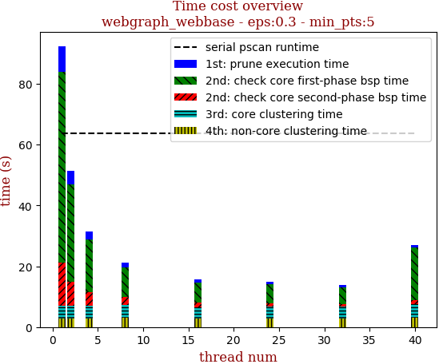

# Experiments

category | detail
--- | ---
algorithm introduction and visualization | see [algorithm_vis](algorithm_vis), with a toy case [demo_input_graph.txt](algorithm_vis/demo_input_graph.txt)
dataset description | see [dataset_description](dataset_description/ReadMe.md)
scalability experiment | see [figures/figures-case-study0](figures/figures-case-study0), parameter setting: `eps:0.3`, `min_pts:5`.
scalability robust scheduling experiment | see [figures/figures-case-study2-robust](figures/figures-case-study2-robust)， parameter setting: `eps:0.3`, `min_pts:5`
workload/serial-runtime experiment | see [figures/figures-case-study1](figures/figures-case-study1), parameter setting: `min_pts:5`

## Todo

* profile to summarize performance related issues
* scalability experiments with different eps, from 0.1 to 0.9
* implement complex logic(keep all pscan ideas) parallel version
* compare to anySCAN and SCAN++, too 

## Observation

### Workload    

* pscan's prunning is powerful in non social networks with `eps:0.1` and `eps:0.2` 

### Scalability

* pscan's prunning(via sd/ed) is more powerful in non social network graphs and lfr benchmark graphs, from [figures/figures-case-study0](figures/figures-case-study0), 
however at most twice evaluation of density from our experiments is affordable, since evaluation phase, i.e, check-core 1st phase bsp has a good scalability 
except for webbase and small datasets.

* **eval comparison table**, parameter setting: `eps:0.3`, `min_pts:5`
 on 9 graphs.

algorithm | dblp | pokec | livejournal | orkut | uk | webbase | twitter | frienster | lfr10m
--- | --- | --- | --- | --- | --- | --- | --- | --- | ---
pscan   | 0.6177 | 0.8520 | 0.7243 | 0.8265	| **0.2439** | **0.2874** | 0.4471 | 0.8566 | **0.5192**
pscan+  | 0.7370 | 0.9209 | 0.8740 | 0.9278 | **0.5175** | **0.5238** | 0.4866 | 0.8764 | **1.0000**

* **`cmp`/`intersection_times` table** 

algorithm | dblp | pokec | livejournal | orkut | uk | webbase | twitter | frienster | lfr10m
--- | --- | --- | --- | --- | --- | --- | --- | --- | ---
pscan | 24.707 | 70.888 | 106.707 | 275.800 | 111.962 | **63.901** | 1841.663 | 385.317 | **22.978**
pscan+ | 23.422 | 67.641 | 101.258 | 264.468 | 146.264 | **88.889** | 1849.282 | 377.788 | **24.199**

* lfr benchmark synthetic graph: lfr benchmark generator very slow, unable to generate large graph efficiently, consider use 10m, 1m vertices, instead of 100m 

* real-world graph more parameters: use more small real-world datasets to do work-load experiments, with different `eps [0,1, 0.9]` and `min_pts [2, 5, 15, 20]`

## Problem

* urgent: need to interpret the performance degradation in webbase.

* must: need to elaborate on why it is not worthwhile to parallelize clustering phase(core clustering and non-core clustering), mention io cost

* must: need to interpret the speedup difference among different input graphs

* small problem: need to elaborate on comparison difference and union-find operation difference, implement more about statistics, give detailed information for workloads

* small problem: need to analyze why lfr benchmark incurs more cost in union-find disjoint-set operation

## Problem Elaboration

### Webbase Performance Degradation

overview | speedup
--- | ---
 | 

### Not Worthwhile Parallelize Union-Find

e.g, lfr-10million-avg15 synthetic graph, i/o cost is much bigger than 3rd/4th serial part

```zsh
int size:4
n:10000001, m:152826874
read degree file time:40 ms
read adjacency list file time:5120 ms
check input graph file time:298 ms

Total input cost:5938 ms
1st: prune execution time:194 ms
2nd: check core first-phase bsp time:1181 ms
2nd: check core second-phase bsp time:623 ms
3rd: core clustering time:5292 ms
4th: non-core clustering time:1289 ms
Total time without IO:8580 ms
Total output cost:10649 ms
```

### LFR Benchmark More Workload in Union-Find

overview | speedup
--- | ---
 | 

reason: zero-pruning in both prune0 and prune1

```
int size:4
n:10000001, m:152826874
read degree file time:210 ms
read adjacency list file time:6301 ms
check input graph file time:305 ms

Total input cost:7336 ms
with google perf start------------
1st: prune execution time:2250 ms
2nd: check core first-phase bsp time:22887 ms
2nd: check core second-phase bsp time:6086 ms
3rd: core clustering time:5106 ms
4th: non-core clustering time:1288 ms

prune0 definitely not reachable:0
prune1 definitely reachable:0
intersection times:76413437
cmp0:247555261
cmp1:1283030908
equal cmp:318549472
max portion:47
with google perf end--------------
Total time without IO:37632 ms
Total output cost:9880 ms
```

## Scripts

category | scripts
--- | ---
scalability | [scalability_experiment.py](scalability_experiment.py), [scalability_figure.py](scalability_figure.py), [generate_markdown0.py](playground/generate_markdown0.py)
workload | [workload_experiment.py](workload_experiment.py), [workload_figure.py](workload_figure.py), [generate_markdown1.py](playground/generate_markdown1.py), [generate_markdown2.py](playground/generate_markdown2.py)
algorithm demo | [pscan_algo.py](algorithm_vis/pscan_algo.py), [pscan_algo_vis.py](algorithm_vis/pscan_algo_vis.py)