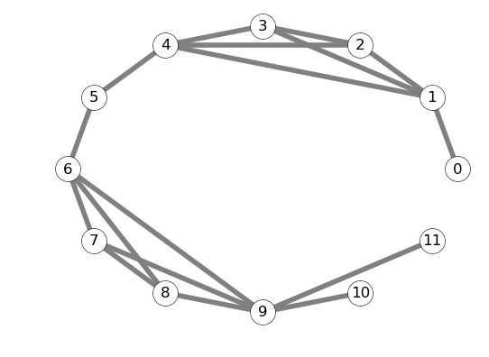

# pSCAN+ Introduction

python implementation (just for demonstration), see [disjoint_set.py](disjoint_set.py), [pscan_algo.py](pscan_algo.py)

usage, with input edge list [demo_input_graph.txt](demo_input_graph.txt):

```zsh
python pscan_vis.py
```

modify this line to use different `eps` and `min_pts`

```python
pscan_algo = PScan(offset_lst, dst_v_lst, deg_lst, eps=0.6, min_pts=3)
```
## Algorithm Example

* input file: [demo_input_graph.txt](demo_input_graph.txt)



csr representation

```python
offset_lst = [0, 1, 5, 8, 11, 15, 17, 21, 24, 27, 32, 33, 34]
dst_v_lst = [1, 0, 2, 3, 4, 1, 3, 4, 1, 2, 4, 1, 2, 3, 5, 4, 6, 
5, 7, 8, 9, 6, 8, 9, 6, 7, 9, 6, 7, 8, 10, 11, 9, 9]
deg_lst = [1, 4, 3, 3, 4, 2, 4, 3, 3, 5, 1, 1]
```

* output sample

```zsh
not_direct_reachable = -2, direct_reachable = -1, not_sure = 0, >0 means min_cn to satisfy direct reachable 

1. after prune, min_cn_lst: [-1, 0, 3, 3, 3, 0, 3, 3, 0, 0, 3, 0, 0, 0, 3, 0, 3, 0, 3, 3, 4, 0, 3, 3, 0, 0, 3, 0, 0, 0, -2, -2, 0, 0]
2.1 after check core 1st bsp, min_cn_lst : [-1, 0, -1, -1, -1, 0, -1, -1, 0, 0, -1, 0, 0, 0, -2, 0, -2, 0, -1, -1, -1, 0, -1, -1, 0, 0, -1, 0, 0, 0, -2, -2, 0, 0]
2.2 after check core 2nd bsp, min_cn_lst: [-1, -1, -1, -1, -1, -1, -1, -1, -1, -1, -1, -1, -1, -1, -2, -2, -2, -2, -1, -1, -1, -1, -1, -1, -1, -1, -1, -1, -1, -1, -2, -2, -2, -2]
2.2 after check core 2nd bsp, similar_degree_lst: [1, 4, 3, 3, 3, 0, 3, 3, 3, 3, 0, 0]
2.2 after check core 2nd bsp, cores: [1, 2, 3, 4, 6, 7, 8, 9]
3. after cluster core, disjoint set - parent dict: {0: 0, 1: 1, 2: 1, 3: 1, 4: 1, 5: 5, 6: 6, 7: 6, 8: 6, 9: 6, 10: 10, 11: 11}
4. after cluster non-core mark cluster id, cluster(represented by root vertex), min ele id: {1: 1, 6: 6}

final result in format: core/non-core vertex id cluster id(min core vertex id in this cluster)
c/n vertex_id cluster_id
c 1 1
c 2 1
c 3 1
c 4 1
c 6 6
c 7 6
c 8 6
c 9 6
n 0 1
```

## Algorithm Components

### 1. Prune

<table>
<tr>

<th>
prune 0, <br/> defintely not directly reachable
</th>
<th>
prune 1, <br/> defintely directly reachable
</th>
</tr>

<tr>
<td  valign="top">

```python
def is_definitely_not_reachable(self, u, v):
    du = self.inc_degree_lst[u]
    dv = self.inc_degree_lst[v]
    return True if min(du, dv) < \
                   max(du, dv) * (self.eps ** 2) else False
```
</td>

<td  valign="top">

```python
tmp = self.compute_cn_lower_bound(i, v)
if tmp <= 2:
    self.prune1 += 1
    self.min_cn_lst[j] = PScan.direct_reachable
else:
    self.min_cn_lst[j] = tmp
```

</td>

</pre>
</td>
</tr>
</table>

### 2.1 Check Core: Eval Density

`eval_density` is the most time consuming part in pscan+ algorithm.

implementation: use merge with early exit strategy to do this `set_intersection` like computation

```python
def eval_density(self, u, edge_idx):
    self.intersect += 1
    v = dst_v_lst[edge_idx]
    cn = 2

    du = self.inc_degree_lst[u] + 1
    dv = self.inc_degree_lst[v] + 1
    offset_nei_u = offset_lst[u]
    offset_nei_v = offset_lst[v]
    min_cn_num = self.min_cn_lst[edge_idx]

    while offset_nei_u < offset_lst[u + 1] and offset_nei_v < offset_lst[v + 1] \
            and cn < min_cn_num <= du and dv >= min_cn_num:
        if self.dst_v_lst[offset_nei_u] < self.dst_v_lst[offset_nei_v]:
            du -= 1
            offset_nei_u += 1
            self.cmp0 += 1
        elif self.dst_v_lst[offset_nei_u] > self.dst_v_lst[offset_nei_v]:
            dv -= 1
            offset_nei_v += 1
            self.cmp1 += 1
        else:
            cn += 1
            offset_nei_v += 1
            offset_nei_u += 1
            self.cmp_equ += 1
    return PScan.direct_reachable if cn >= min_cn_num else PScan.not_direct_reachable
```

### 2.2 Check Core: Cross Link

e.g, for edge (3,1), fetch the property from edge (1,3), find the cross-link via binary search

this is the second time-consuming part of pscan+

```python
def binary_search(self, array, offset_beg, offset_end, val):
    self.binary_search_call += 1
    mid = (offset_beg + offset_end) / 2
    if array[mid] == val:
        return mid
    return self.binary_search(array, offset_beg, mid, val) if val < array[mid] \
        else self.binary_search(array, mid + 1, offset_end, val)


# 2nd: check core 2nd bsp computation
def check_core_2nd_bsp(self, u):
    for edge_idx in xrange(self.offset_lst[u], self.offset_lst[u + 1]):
        v = self.dst_v_lst[edge_idx]
        if u > v:
            self.min_cn_lst[edge_idx] = self.min_cn_lst[
                self.binary_search(self.dst_v_lst, self.offset_lst[v], self.offset_lst[v + 1], u)]
        if self.min_cn_lst[edge_idx] == PScan.direct_reachable:
            self.similar_degree_lst[u] += 1
```

### 3. Cluster Core

compute connected components of cores-induced subgraph, use [disjoint_set.py](disjoint_set.py), 
see CLRS for detailed proof of time complexisty.

```python
def cluster_core(self, u):
    for edge_idx in xrange(self.offset_lst[u], self.offset_lst[u + 1]):
        if self.min_cn_lst[edge_idx] == PScan.direct_reachable \
                and self.is_definite_core_vertex(self.dst_v_lst[edge_idx]):
            # print 'union ', u, self.dst_v_lst[edge_idx]
            self.disjoint_set.union(u, self.dst_v_lst[edge_idx])
```

### 4. Cluster Non-core

cluster non-cores if some are dense enough to cores, a non-core vertex may have multiple belongings

adopted data structure:

```python
self.cluster_dict = [self.n] * self.n
self.non_core_cluster = []
```

```python
def mark_cluster_min_ele_as_id(self):
    for i in xrange(self.n):
        if self.is_definite_core_vertex(i):
            x = self.disjoint_set.find_root(i)
            if i < self.cluster_dict[x]:
                self.cluster_dict[x] = i


# 4th: cluster non-cores
def cluster_non_core(self):
    self.mark_cluster_min_ele_as_id()
    for i in xrange(self.n):
        if self.is_definite_core_vertex(i):
            for j in xrange(self.offset_lst[i], self.offset_lst[i + 1]):
                if not self.is_definite_core_vertex(self.dst_v_lst[j]) \
                        and self.min_cn_lst[j] == PScan.direct_reachable:
                    self.non_core_cluster.append(
                        (self.cluster_dict[self.disjoint_set.find_root(i)], self.dst_v_lst[j]))
```